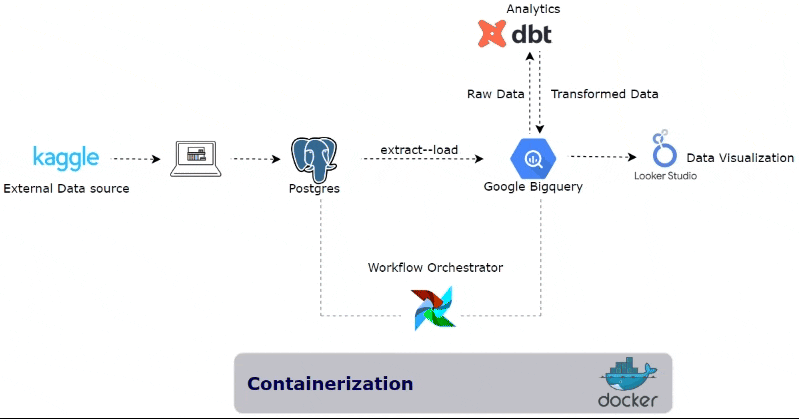

# E-commerce End-to-End ELT Pipeline Project

<p align="center">
  
</p>

# Overview
This project demonstrates the development of an end-to-end ELT (Extract, Load, Transform) pipeline using a real-world dataset from [Kaggle](https://www.kaggle.com/datasets/olistbr/brazilian-ecommerce), specifically the Brazilian E-Commerce Public Dataset. The goal of this project is to transform raw e-commerce data into structured insights that can answer key analytical questions valuable to stakeholders and data end-users.

## Key Analytical Questions

By processing and transforming the e-commerce data, the project aims to answer the following key questions:

1) #### Which product categories have the highest sales?

- This analysis identifies the top-performing product categories based on total sales, helping businesses focus their efforts on the most profitable segments.

2) #### What is the average delivery time for orders?

- This metric provides insights into the efficiency of the delivery process, enabling the identification of potential bottlenecks and areas for improvement.

3) #### Which states have the highest number of orders?

- Understanding regional demand is crucial for targeted marketing and logistics planning. This analysis reveals the states with the highest order volumes.

# Tech Stack

- **Docker & Docker Compose**: Containerization and orchestration of services.
- **PostgreSQL**: Source database for raw data ingestion.
- **Apache Airflow**: Workflow orchestration and task scheduling.
- **dbt (Data Build Tool)**: Data transformation and modeling.
- **Google BigQuery**: Data warehousing and analytics.
- **Terraform**: Infrastructure as code for managing Google Cloud resources.
- **Languages**: Python and SQL.

# Project Structure

```plain text
ecommerce_elt/
│
├── airflow_infra/
|   ├── config/
|   |  └──keyfile.json                          # Put the google application credentials here 
|   |     
│   ├── dags/
│      └── postgres_to_bigquery.py   # Airflow DAG to orchestrate the ETL process   
│
├── dbt/
│   └── dbt_workspace/
│       ├── models/                             # Folder containing models
│       │   ├── staging/                    
│       │   ├── intermediate/
│       │   └── final/
|       ├── tests/                              # Folder containing Singular Tests
│       ├── dbt_project.yml                     # DBT project configuration file
│       └── README.md                           # ReadMe file explaining the dbt models
│
├── postgres_infra/
│   ├── data/                                 # Folder containing raw data files
│   └── infra_script/
│       └── init.sql                          # SQL script to initialize the PostgreSQL database
│
├── terraform/
│   ├── main.tf                               # Terraform configuration file for Google BigQuery setup
│   └── variables.tf                          # Terraform variables file
│
├── .env                                      # Environment variables file
├── docker-compose.yml                        # Docker Compose file to orchestrate all services
├── Dockerfile                                # Dockerfile to build custom Docker images
├── requirements.txt                          # Dependencies 
└── README.md                                 # Project documentation
```

# Setup Instructions
## Prerequisites
Before starting the project, ensure that you have the following installed and set up on your machine:

- **Docker & Docker Compose**: Required for containerizing and orchestrating the various components of the project.

- **Python**: Needed for running scripts and interacting with Airflow and dbt.

- **Google Cloud Platform (GCP) Access**: Required for setting up BigQuery, enabling relevant APIs, and managing cloud resources.

## Step-by-Step Setup

#### Clone the repository:

```bash
git clone https://github.com/Isioma57/ecommerce_elt.git
cd ecommerce_elt
```
#### Create a virtual environment and activate it:

```bash
python -m venv venv
source venv/Scripts/activate # On MacOs use `source venv/bin/activate`
```

#### Install required packages:

```bash
pip install -r requirements.txt
```

# How to Spin up the Server

### Google Cloud Setup
Before spinning up the Docker environment, ensure that you have set up Google Cloud correctly. Follow these steps:

1) #### Create a New Google Cloud Project:

    - Log in to your Google Cloud Console.
    - Create a new project for this ETL process.

2) #### Create a Service Account:

    - In the Google Cloud Console, navigate to IAM & Admin > Service Accounts.
    - Create a new service account, providing it with a relevant name.
    - Download the JSON key file for this service account and store it in the config folder inside the airflow_infra directory. This file will be referenced in the .env file.

3) #### Assign Roles to the Service Account:
    Assign the following roles to the service account:
    - BigQuery Admin: Provides full control over BigQuery resources.
    - Service Usage Viewer: Allows the service account to view service usage and related metrics.

4) #### Enable Required APIs:

    - Go to APIs & Services > Library.
    - Search for and enable the Cloud Resource Manager API. This is necessary for managing and accessing your Google Cloud resources.

### Configuration File Setup
Configure the .env file to ensure proper connections between services. Rename .env.example to .env and fill in your credentials and project-specific information:

```plain text
# Airflow details
AIRFLOW_UID=50000
_AIRFLOW_WWW_USER_USERNAME=your_username_here
_AIRFLOW_WWW_USER_PASSWORD=your_password_here
AIRFLOW_PROJ_DIR=./airflow_infra
HOST_ENV_FILE_PATH=./.env

# Postgres Connection Details -- source database
POSTGRES_USER=your_username_here
POSTGRES_PASSWORD=your_password_here
POSTGRES_DB=ecommerce
POSTGRES_HOST=source_db
POSTGRES_PORT=5432

# Google Application Credentials
GOOGLE_APPLICATION_CREDENTIALS=/opt/airflow/config/your_.json_key_here

# Google Cloud BigQuery Connection Details -- destination database
GCP_PROJECT_ID=your_project_id_here
GCP_BQ_KEY_FILE=/opt/airflow/config/your_.json_key_here
```

### Terraform Variable.tf Setup

In the terraform variable.tf script, put in your project id:
```json
variable "project_id" {
   description = "My Project ID"
   default = "your_project_id_here"
}
```

### Running the Docker Environment
Once the above configurations are complete:

1) Ensure your .env file is correctly configured with the necessary details.

2) Navigate to the project directory containing your docker-compose.yml file.

3) Spin up the Docker environment by running the following command:
```bash
docker compose up -d
```
This command will launch all the services defined in the docker-compose.yml 

# How to trigger the Airflow Dag

Once you've run `docker-compose up`, follow these steps to extract data from PostgreSQL and load it into BigQuery:

1. **Access the Airflow UI:**
   - Open your web browser and navigate to the Airflow UI at:
     ```
     http://localhost:8080
     ```

2. **Login to Airflow:**
   - Use the credentials you specified in the `.env` file (`_AIRFLOW_WWW_USER_USERNAME` and `_AIRFLOW_WWW_USER_PASSWORD`) to log in.

3. **Trigger the DAG:**
   - In the Airflow UI, find the DAG named `postgres_to_bigquery`.
   - Toggle the DAG to "On" by clicking the "On/Off" button.
   - Trigger the DAG manually by clicking the "Trigger DAG" button (the play button) on the right side of the DAG's row.

4. **Monitor the DAG:**
   - You can monitor the progress of the DAG execution in the "Graph View" or "Tree View" to ensure that all tasks are completed successfully.

5. **Check Data in BigQuery:**
   - Once the DAG has finished running, you can verify that the data has been loaded into your BigQuery dataset by checking the tables in the BigQuery Console.

Following these steps will ensure that the data is successfully extracted from the PostgreSQL database and loaded into BigQuery using Airflow.

# Running dbt for Data Transformation and Modeling

### Setting Up dbt

#### Configure `profiles.yml`

To connect dbt to your BigQuery dataset, you'll need to create a `profiles.yml` file. Here's how you can do it:

1. **Locate or Create the `.dbt` Directory:**
   - If you don't have a `.dbt` directory in your home directory, create it. 
   - On Linux or macOS, this would be `~/.dbt/`.
   - On Windows, this would be `C:\Users\<your_user>\.dbt\`.

2. **Create or Edit the `profiles.yml` File:**
   - Inside the `.dbt` directory, create or open the `profiles.yml` file.
   - Add the following configuration, replacing the placeholder values with your actual credentials and project details:


```yaml
dbt_workspace:
  outputs:
    dev:
      dataset: ecommerce
      job_execution_timeout_seconds: 300
      job_retries: 1
      keyfile: /path_to_your_service_account_key/your_.json_key_here
      location: EU
      method: service-account
      priority: interactive
      project: your_project_id_here
      threads: 4
      type: bigquery
  target: dev
```
#### Test the Connection:

Once your profiles.yml is configured, you can test the connection as follows:

  - Navigate to the dbt Project Directory:
```bash
cd dbt/dbt_workspace
```
  - Rub dbt debug to test connection:
  ```bash
  dbt debug
  ```

### Testing and Running the Models
Test the Models:
You can run tests to ensure that the models have been built correctly:
```bash
dbt test
```
Run the dbt models to transform the data and create the required tables in BigQuery.
```bash
dbt run
```

### Verify the Results
After running the models, you can verify the results in your BigQuery dataset. The transformed tables should now be available and populated with the processed data.

# Note
For detailed information on the dbt models and transformations, please refer to the README documentation located within the `dbt` directory.

# Troubleshooting
If you encounter any issues during the process, here are some basic troubleshooting steps:

Checking Logs:

If a service fails to start or behaves unexpectedly, you can check its logs using the following command:
```bash
docker-compose logs <service-name>
```
Replace <service-name> with the name of the service (e.g., postgres, airflow-webserver, terraform).

# License

This project is licensed under the MIT License.